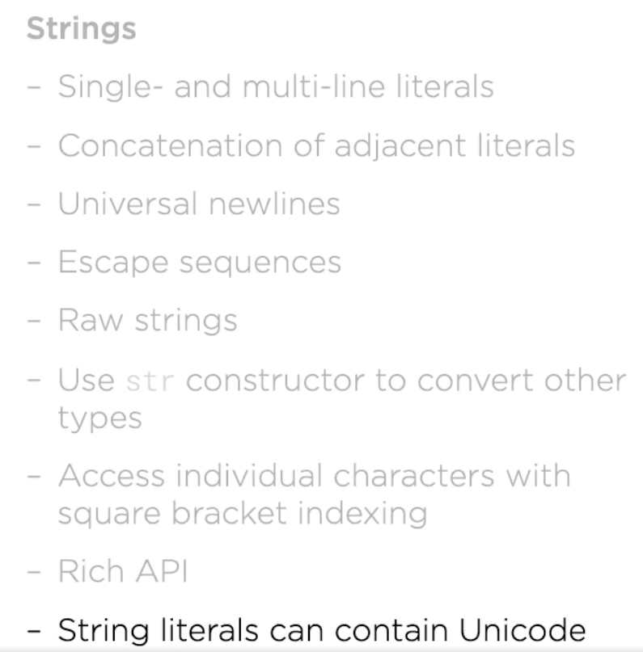

Python Internals
The Python source code goes through the following to generate an executable code : 
 

- Step 1: The python compiler reads a python source code or instruction. Then it verifies that the instruction is well-formatted, i.e. it checks the syntax of each line. If it encounters an error, it immediately halts the translation and shows an error message.
- Step 2: If there is no error, i.e. if the python instruction or source code is well-formatted then the compiler translates it into its equivalent form in an intermediate language called “Byte code”  (.pyc or .pyo).
- Step 3: Byte code is then sent to the Python Virtual Machine(PVM) which is the python interpreter. PVM converts the python byte code into machine-executable code. If an error occurs during this interpretation then the conversion is halted with an error message.

Significant WhiteSpace Rules
- Space and 4 spaces is standard
- You can also use tabs, but never mix them
- Prefer spaces then tabs

Documentation [PEP 8]
- Zen of Python

Modules 
- import standard library using inport keyword
- module_name.attribute_name e.g import math
- if you don't know what to import inside math type => help(math)

Relation Operators
 - Equality ==
 - Inqueality !=
 - Less then Equal <=

Conditional Statement
- If Statement
- ``if true`` print ("i will be printed"")
- `if "eggs" print("i will be printed"")`
- if-elif-else


Loops
```
while c != 0:
    print(c)
    c -= 1
```
- We can also use while c: as when c ==0 it wil be false but Python Zen says 
- ZEN 1 : Explicit is better than implicit
- Use while for infinite loop **break** to get out
- ctrl+c gives Keyboard IntreptedException

- FORLOOP
```
story = urlopen('http://sixty-north.com/c/t.txt')
story_words = []
for line in story:
    line_words = line.split()
    for word in line_words:
        story_words.append(word)
```

Collections
- String 
    - Keyword str
    - Sequence of unicode code points
    - Immutable
    - Can use single or double quotes
    - ZEN 2: Practicality Beats Purity
    - Multiline String use three quotes ''' OR """
    - Universal NewLines \n translates to appropriate newline sequence for OS
    - Escape Sequnce - use backslash e.g " I there quote \" "
    - Since string is a sequence we can do like 
    - types
    - 
    - ```
      s = 'parrot'
      s[4] ==> returns "o" to test
      type(s[4]) ==> returns class 'str'
      ```
    - str is Unicode, can use with international
  
- Bytes
    - Sequence of Bytes 
    - Raw binary Data
    - Fixed width single byte encodings
    - b 'data' ==> b needs to be prefix
    - d= b 'some bytes' ==> d[0]  returns 115
    - -http response are send as bytes streams
    - Encode/Decode
        - ```
          norsk = " assume norwegian characters"
          data = norsk.encode('utf8')
          norwegian = data.decode('utf8')
          ```
          
- List
    - Seq of objs
    - mutable
    - a = ["apple", 7, "pear"]
    - b = []
    - b.append(1.414)
    -list ("characters")

-Dict : Since Python 3.7 entries are kept in insertion order
    - {k1: v1}
    - d = {'alice': '878-8434-343'}
    - d['alice'] = '423-4244-544'
    - e = {} //empty dict