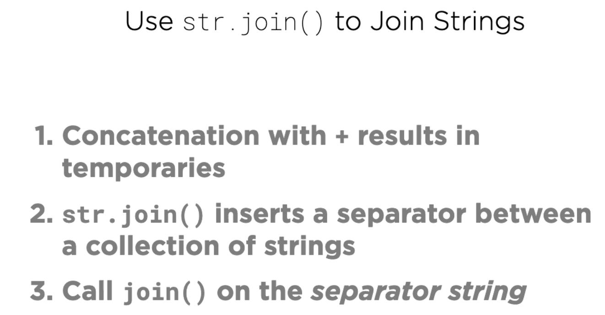
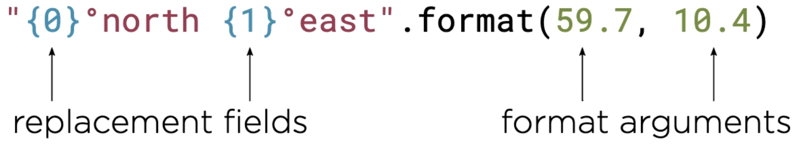
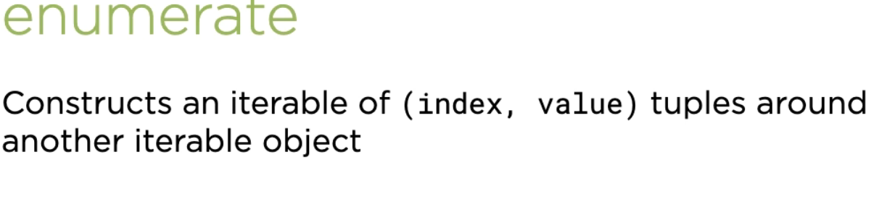
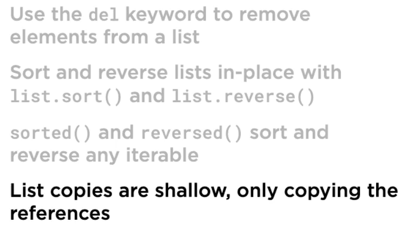

Tuple
- Immutable sequences of arbitrary objects, once create new elements can't be added
- 
- To define single element tuple, put a comma at the end otherwise python will treat it as an integer
- 
- Empty tuple
- 
- Brackets in tuple is not mandatory
- 
- TUPLE UNPACKING - Destructing operation that unpacks data structures into named reference
- Check code for tuple
- 

### **_STRING IMMUTABLE_**

- 
- Prefer Join instead of + , won't have al the string lying around and update teh existing string
- 
- 
- Partition - use underscore when you need to ignore the value 
- 
- String Formatting - replace fields filled by arguments
- 
- 
- Instead of using .format use F-String
- 
- 

RANGE
- Seq representing an arithmetic progression of integers
- 
- 
- 
- If we need a counter in a loop use the enumerate function
- 
- 

### LIST
- Negative Indices starting from end rather then beginning
- This works for tuple and strign as well
- 
- Slicing, pass the first and last substring index
- 

## PROTOCOLS

## SUMMARY

