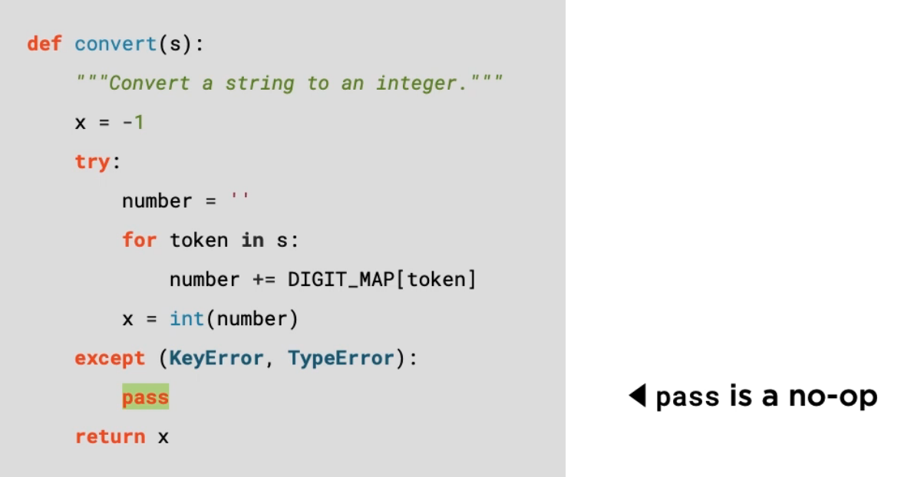
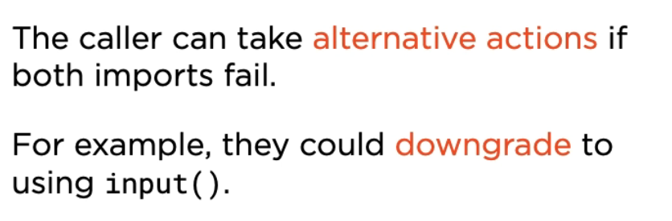

- If key in dict not present error
- 
- 
- Let's modify our function to handle error
- 
- ```
  from exceptions.exceptional import convert 
  convert("fdsfds".split()) 
  ```
- convert(512) this time it will Type error as it is expecting the string
- 
- Except can accept a tuple i.e multiple exception
- -Pass 
- 
- -Accessing Exception Objects and print error detail to standard error stream
- 
- -F String ! Feature 
    - If you insert an !r after the expression, the repr representation of the value would be inserted 
    - ```
      exceptions.exceptional import convert
      convert("fail".split())
      ```
      
- Re-Raising Exception
- Send code back to caller is a bad practise as it can be ignored we should use raise
- 

-Exceptions are Part of API
- 
- 
- 
- 
- IndexError, ValueError, KeyError
- Avoid Explicit Type Checks
- 
- 
- 2 Approach to prepare for failure
- 
- 
- 
- 
- 
- 
- 
- 

CleanUp Actions
- COntext Managers
- For simple case use finally
- 
- 
- 

Platform Specific Code
- 
- Even though msvcrt.getch() is inside the try block but it's scope will be module
- If import is failed as we are not running in windows we go inside except ImportError
- 
- 
- 


SUMMARY
- 
- 
- 
- 