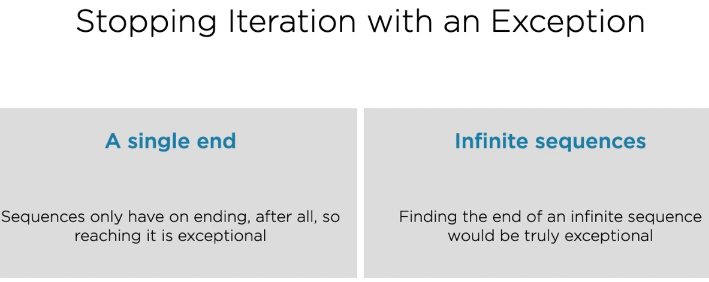

### List 

- 
- -Equivalent imperative code
- 
- 
- 
- Comprehensions shouldn't have any side effects like printing to console then use for loops
- ```
   print([x for x in range(101) if is_prime(x)])
  ```
- Avoid excess complexity in comprehensions as it is less readable
- 

Iterable and Iterator
-Used when you don't want to traverse through the whole collection
- Iterable - Allow us to pass an iterable objects [usually a collection or stream of objs] to built in iter() fn
to get iterator for the iterable object
- Iterator - Requires that we can pass the iterator object to the built-in next to fetch the next value from 
the underlying collection
- 
- Once reached the end Python raises StopIteration exception
- -
- Higher level constructs like for loop etc are built directly on iterable and iterator


## Generator Functions
- 
- Yield
- 
- These FUnction return generator obj which are iterator
- Also since iterator are iterable generator obj can be pass to any context which expect iterable like for loops
- 
- Maintaining State in Generators
- Resume flow nature make these generators more complex so we will use pycharm debugger
- 
- USe the list contructor to acheive this
- ```
  for item in take(3, list(distinct(items)))
  ```
-  

- #### Generator Expression
- Cross with comprehension and generators
- Similar syntax as comprehension
- Result in a generator object 
- 
- Generator are single use objects
- 
- 
- Execute right away
- 

## Iteration Tools
- 
- 
- 
- 
- 
- 
- 
- 

### SUMMARY
- 
- 
- 