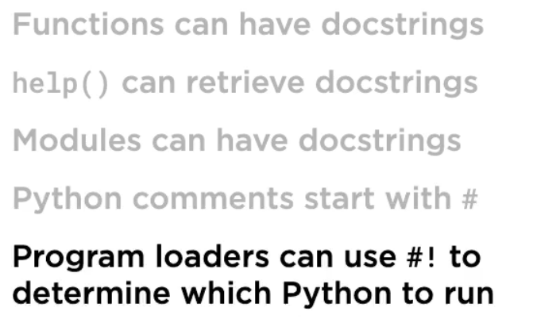

Run a module
```
python words.py
```
- Import Module
    - Below code will execute the code as soon as import happens, to prevent it use functions
  ```
  import words
  ```

Functions :
 - special function will have __feature__
 - pronunce it as dunder feature name
 - change all the code in words.py into a function call fetch_words
 - To run the function from repl
  ```
>>> from modularity.words import fetch_words 
>>> fetch_words() 
  ```
- now in repl when you do **python words.py** nothing is run 
- We can use __name__ a specifically named variable allowing us to detect 
  whether a module is run as a script ot imported into another module. 
- put  print in the words.py print (__name__), depending on the context it is run differently
- 
- Add below snippet now it will not run when you import adn run when we run in repl as a script
```
  if __name__ == '__main__':
        fetch_words()
```
-Multiple function imports
```
>>> from modularity.words import (fetch_words, print_items) 
>>> print_items(fetch_words()) 
```

Python Execution Model
- def is a statement, cause the code inside it to bind it with the name
- Top Level functions are defined when a module is imported or run
- Anything with py extension is module
- Module can be used for easy import or easy execution or using dunder name for both
- Recommendation to have the easiest script should also be importable
- 

Command Line Arguments
- import sys module
- sys.args[1]
- ZEN#3 - Two blank lines between functions

Doc Strings
- 
- 
- 
- help (fetch_words) gives you docstrings

Shebang
- First line use #!
- tells which interpreter to use to run the program
- Locate Python to run
- #! /usr/bin/env python3
- On linux we need to make file executable for shebang to take an effect
- chmod +x words.py
- ./words.py http://sixty-north.com/c/t.txt
- In windows we have Pylaucher [py.exe] in path which will parse the shebang and locate the python
- .\words.py http://sixty-north.com/c/t.txt this will run even if you hae python 2 install 

SUMMARY
- 
- 
- 